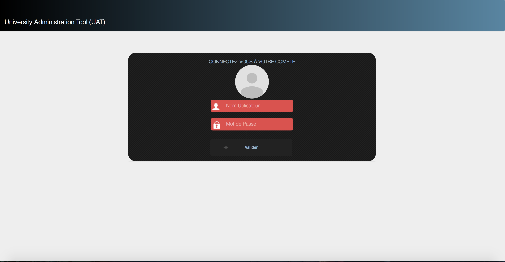
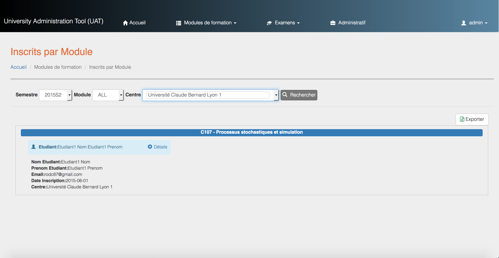
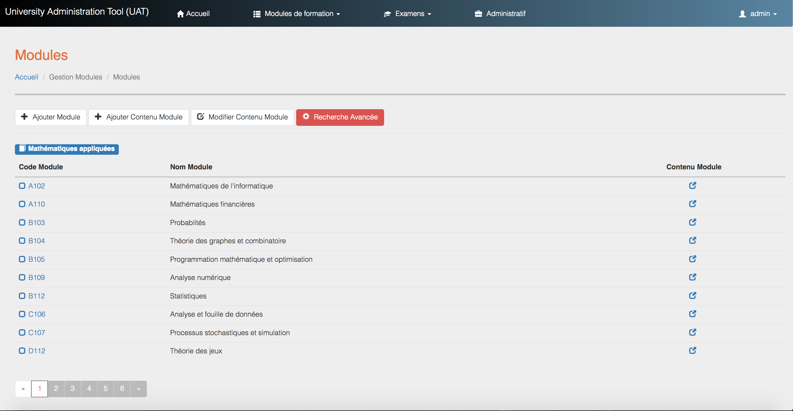
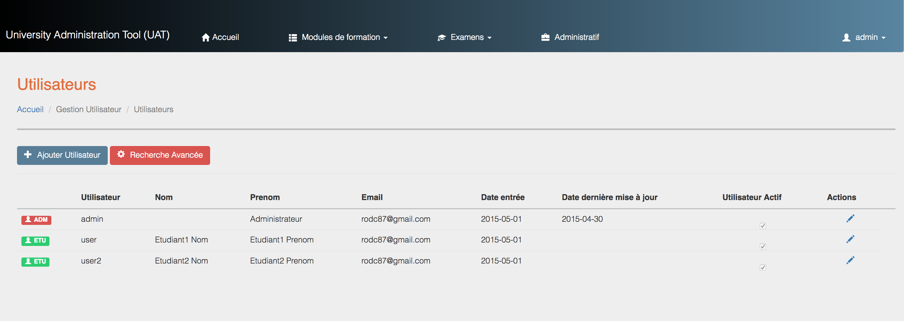

# University Administration Tool

This is a Laravel Application that helps in the administration tasks of an University such as: Semesters, Registration Periods, Students, Tutors, Documents, Student Grades, Exams, Exam Registration, Module Registration & Content Administration.

### Use docker-compose to run application, this creates a Laravel Application with a Mysql Database and an optional Database Administration Tool - phpMyAdmin:

    docker-compose up

### Make sure to change the docker-compose file and .env file database settings based on your preferences :

    ------------------------
    docker-compose.yaml file
    ------------------------

      # The Database
      database:
        build:
          context: ./
          dockerfile: db.dockerfile
        ports:
          - "3306:3306"
        environment:
          - "MYSQL_HOST=192.168.99.100"
          - "MYSQL_DATABASE=university_adm"
          - "MYSQL_USER=admin"
          - "MYSQL_PASSWORD=admin"
          - "MYSQL_ROOT_PASSWORD=admin"
        volumes:
          - dbdata:/var/lib/mysql

      ---------
      .env file
      ---------
      DB_CONNECTION=mysql
      MYSQL_HOST=192.168.99.100
      DB_PORT=3306
      MYSQL_DATABASE=university_adm
      MYSQL_USER=admin
      MYSQL_PASSWORD=admin

## Screenshots:

